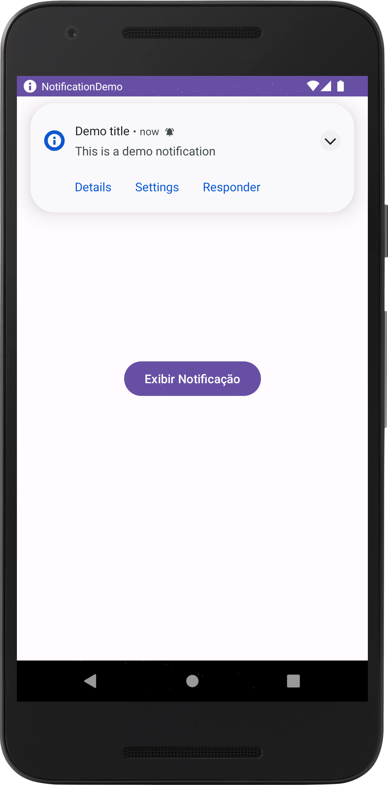
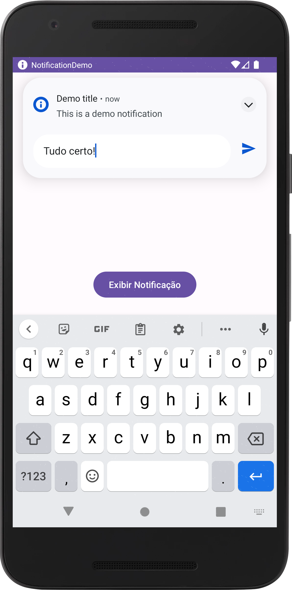
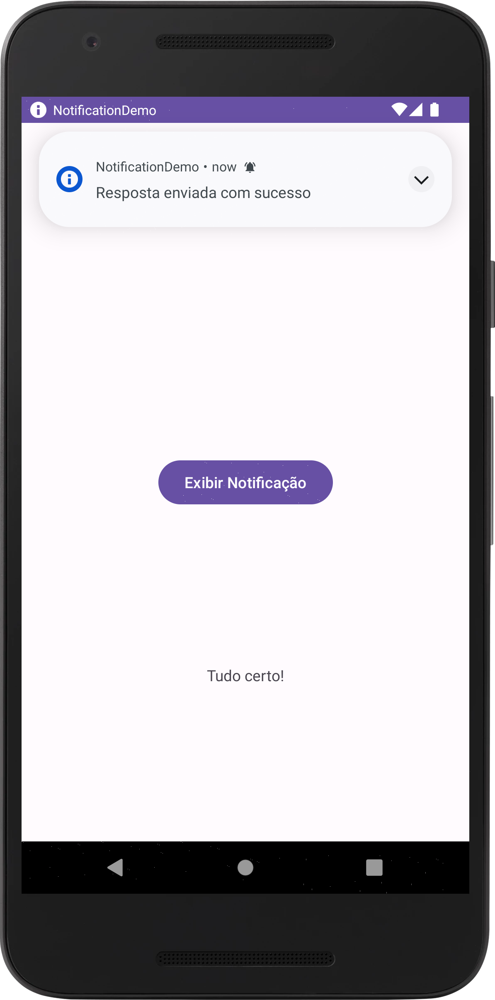

# Notification Demo

Um app que exibe notificações no Android.

Autor: Guilherme Reis - [LinkedIn](https://www.linkedin.com/in/guilhermereisdev/)

### Recursos do app

- Exibe notificações com botões de ação que levam para variadas telas do app.
- Exibe uma opção com caixa de texto na notificação para envio de respostas rápidas sem necessidade de abrir o app.

### Técnicas utilizadas

- NotificationCompat para criar e exibir as notificações com opções de botões e caixa de texto.

### Telas

_Clique na imagem para ver em tela cheia_

   
